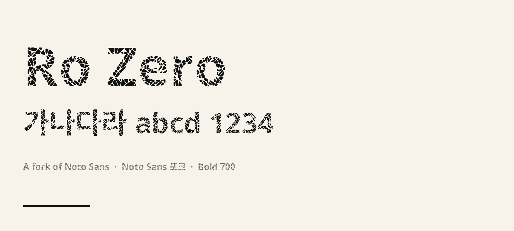

# Ro Zero

**Ro Zero is a fork of [Noto Sans](https://github.com/notofonts/notosans).**

Noto Sans 글자 아웃라인을 파쇄해 만든 디스플레이 패밀리입니다. 원본 서체는 Noto Sans가 아니고, Noto Sans의 **포크 / Modified Version**입니다. 가족 이름은 **Ro Zero**이며 이름에 “Noto”를 쓰지 않습니다. “Noto”는 Google LLC 상표입니다.

라이선스는 [SIL Open Font License 1.1](OFL.txt)입니다. 공개 저장소: [github.com/ro0kr/ro-zero](https://github.com/ro0kr/ro-zero).

## About

Each glyph is shattered into about 100 stone-like shards with 30% crack gaps. Crack roughness is 0 (straight fractures). The shatter seed is the character code point (`A` is 65). Weight does not change the seed. Corner rounding uses a radius measured from Noto Sans Black 900.

Shipped coverage is **Korean + English + punctuation/symbols**. CJK ideographs and other scripts are not included.

Styles: Thin 100, ExtraLight 200, Light 300, Regular 400, Medium 500, SemiBold 600, Bold 700, ExtraBold 800, Black 900. The specimen uses **Bold 700**.

Upstream sources (unmodified OFL Noto files) live in `fonts/noto/`. Built fonts live in `fonts/ttf/`.

## Specimen



Test line (Bold 700): `가나다라 abcd 1234`

## License

- **Font Software:** [OFL.txt](OFL.txt) — SIL Open Font License 1.1
- Copyright 2026 The Ro Zero Project Authors (https://github.com/ro0kr/ro-zero)
- Copyright 2015–2022 Google LLC, The Noto Project Authors

This is a Modified Version of Noto Sans. Shipped files cover Hangul, Latin, and punctuation/symbols. See [FONTLOG.txt](FONTLOG.txt), [NOTICE.md](NOTICE.md), and [TRADEMARKS.md](TRADEMARKS.md).

There is no Reserved Font Name on “Ro Zero”.

## Google Fonts layout

```
AUTHORS.txt
CONTRIBUTORS.txt
FONTLOG.txt
OFL.txt
README.md
TRADEMARKS.md
documentation/
  DESCRIPTION.en_us.html
  ro-zero-specimen.png
fonts/
  noto/          # unmodified Noto Sans sources (the upstream of this fork)
  ttf/           # Ro Zero Thin–Black
sources/
  build.sh
  config.yaml
requirements.txt
```

## Build

```bash
python3 -m pip install -r requirements.txt
python3 fetch_fonts.py
bash sources/build.sh
```

`build.sh` runs `python3 build_font.py --family`, writes `fonts/ttf/RoZero-*.ttf`, and zips them as `downloads/ro-zero-100-900.zip`.

TTF files are large (about 58–96 MB each). Git LFS tracks `fonts/ttf/*.ttf`.

## Preview

```bash
python3 server.py
```

[http://127.0.0.1:48721](http://127.0.0.1:48721)

## Tests

```bash
python3 test_svg_pattern.py
```
